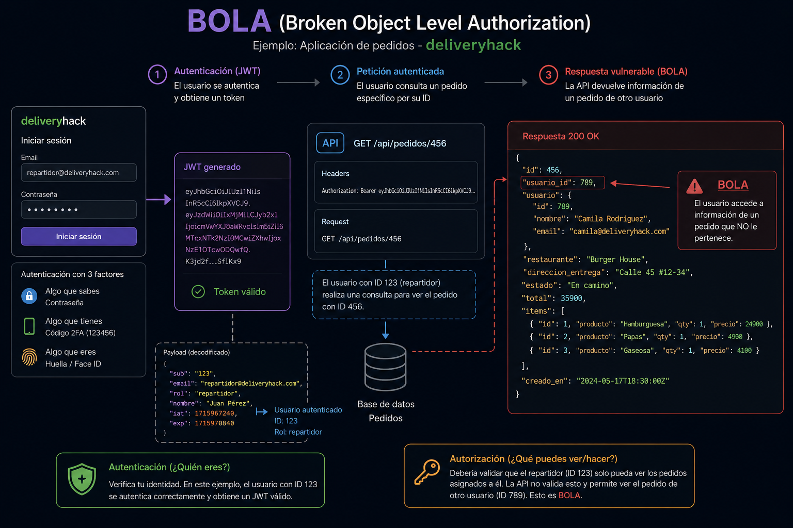

# 🆔 ¿Qué carajos es BOLA y por qué OWASP la considera la mayor amenaza para las APIs?
> Cuando estar autenticado no significa estar autorizado

Una vulnerabilidad BOLA **(Broken Object Level Authorization)** ocurre por una falla en la autorización de las peticiones. Esto significa que un usuario puede estar correctamente autenticado en una aplicación, pero eso no quiere decir que tenga permiso para consultar o modificar información que pertenece a otros usuarios.Para entenderlo mejor, primero debemos diferenciar dos conceptos clave: **autenticación y autorización.**

**La autenticación** responde a la pregunta: ¿quién eres? Es el proceso mediante el cual un sistema verifica la identidad de un usuario. Por ejemplo, cuando una persona ingresa su usuario, contraseña y un segundo factor de autenticación, el sistema valida que realmente sea quien dice ser. Esta verificación puede apoyarse en tres tipos de factores: algo que sabes, como una contraseña; algo que tienes, como un código 2FA o un token; y algo que eres, como una huella o reconocimiento facial.

En el mundo de las APIs, un ejemplo común de autenticación es el uso de JWT. El usuario inicia sesión con sus credenciales y, si son correctas, la aplicación genera un token de acceso. A partir de ese momento, cada petición enviada a la API puede incluir ese token para demostrar que el usuario está autenticado.Sin embargo, estar autenticado no significa tener acceso a todos los datos del sistema. Aquí entra el concepto de **autorización**, que responde a la pregunta: ¿qué puedes ver o hacer?
La autorización define las acciones permitidas y los datos a los que un usuario puede acceder según su rol, permisos o relación con el recurso solicitado.Por ejemplo, en una aplicación de pedidos llamada deliveryhack, un repartidor autenticado debería poder consultar únicamente los pedidos que tiene asignados y la ruta para entregarlos. En cambio, un administrador podría tener permisos más amplios, como ver pedidos en bodega, pedidos despachados, pedidos entregados y asignar entregas a los repartidores disponibles.



El problema aparece cuando la API solo valida que el usuario tenga un JWT válido, pero no verifica si ese usuario tiene permiso sobre el pedido consultado. Por ejemplo, si el repartidor con ID 123 consulta el endpoint:
```http
GET /api/pedidos/456
Authorization: Bearer <jwt_valido>
```
y la API responde con información de un pedido asociado a otro usuario, entonces estamos frente a una vulnerabilidad BOLA. En este caso, la autenticación funcionó correctamente, porque el usuario tenía un token válido, pero la autorización falló, porque el sistema no comprobó si ese pedido realmente le pertenecía o estaba asignado a él.

### En resumen
BOLA no ocurre porque el usuario no esté autenticado, sino porque la API no valida correctamente si ese usuario está autorizado para acceder al objeto solicitado. Por eso, cada petición a recursos como pedidos, cuentas, facturas, perfiles o documentos debe validar no solo la identidad del usuario, sino también su permiso específico sobre el recurso consultado.


## Mitigación de BOLA en APIs en 3 pasos

Mitigar BOLA no consiste solo en usar JWT, OAuth 2.0 o un login seguro. La solución real es validar que cada usuario tenga permiso sobre el recurso específico que quiere consultar, modificar o eliminar.

### 1. Diseñar el modelo de autorización

Antes de construir la API, define claramente:
```
→ Qué roles existen.
→ Qué recursos puede ver cada rol.
→ Qué acciones puede ejecutar.
→ Bajo qué condiciones puede acceder a la información.
```
```
Cliente → solo puede ver sus propios pedidos.
Repartidor → solo puede ver pedidos asignados.
Administrador → puede gestionar pedidos según sus permisos.
```
### 2. Implementar controles en el backend

La autorización debe validarse en el backend, no en el frontend. Cada endpoint que reciba un ID debe comprobar:
```
→ ¿El usuario está autenticado?
→ ¿Tiene el scope correcto?
→ ¿Su rol permite esta acción?
→ ¿El recurso le pertenece o está asignado a él?
```
### 3. Probar escenarios de abuso

No pruebes solo el “camino feliz”. También valida intentos de acceso indebido. Casos mínimos:
```
→ Usuario A consulta datos de Usuario A → permitido.
→ Usuario A consulta datos de Usuario B → denegado.
→ Cliente consulta pedido de otro cliente → denegado.
→ Repartidor consulta pedido no asignado → denegado.
→ Usuario con token válido pero sin permiso → denegado.
```
Para mitigar BOLA, cada petición debe validar tres cosas:
```
Identidad → ¿quién eres?
Permiso → ¿qué puedes hacer?
Relación → ¿puedes hacerlo sobre este recurso?
```
